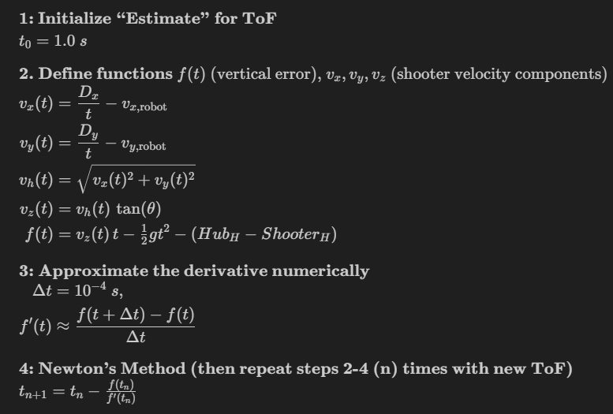
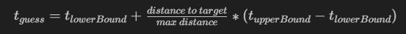

# 2026 Pearadox CompBot

## Shoot On The Move (SOTM)

This year, our software team has been experimenting with "Shoot On the Move." The idea is simple: ensure that our swerve robot can accurately and precisely launch fuel into the hub while simultaneously driving on the field. This is especially useful with a turretted shooter since our robot can be intaking and launching fuel at the same time which may be useful during intense matches.

Throughout the course of the season, there have been some key lessons, ideas, and takeaways that we've learned that we'd like to share:

### Week 1-2: Physics-Based Model

- Decided to initially implement a physics-based projectile model.
- Learned from team 6907's GOATSim to "lead" the robot's shots towards a different "target" to account for its translational velocity: https://team-6907.github.io/u2026_Shooting_Visualizer/
- Team built a Minimum Viable Robot (MVR) early in the season with a static shooter to allow programmers to experiment with shoot on the move methods (easy translation to turret — instead of setting the robot's heading to the desired turret angle, we’ll rotate the turret itself)
- Chose to utilize field localization from Limelight odometry for aiming and shooting into hub because the Limelight will be static (i.e. not moving), meaning may not see the hub if robot is turned to a certain orientation
- Used Newton's Method
 and kinematics to estimate the Time-of-Flight (airtime) for the fuel based on the robot's translational velocity and distance to the target from Limelight odometry updates:

    


- Derived required field-relative shooter launch velocities (vx, vy, vz) that compensate for translational robot motion, then computed total shooter wheel speed and a field-relative turret angle to “lead” the target.
- Output a "ShotSolution" containing time-of-flight, scaled shooter speed, and turret angle, while logging intermediate values for debugging and visualization.


### Week 3-4: Real-World Corrections
- Observed shooter underperformance due to velocity transfer inefficiencies.
- Introduced empirical scaling factor(s) (multiplying by a constant) to correct shooter speed in the real-world, drastically improving performance.
- Experienced inconsistent hopper & agitator transfer to feeder on the MVR (making it difficult to test rapid fuel shots or observe shooter kickback)
- After analyzing videos, the primary factor behind missed shots seemed to not be the robot's translational speed, but rather its **acceleration**.
- Noticed that shooter wasn't spinning up to desired velocity fast enough when strafing at higher speeds, so we added a constant to the applied velocity which fixed most of the issue (i.e. setting shooter velocity to desired velocity + 5 rps)
- Tested bang-bang velocity control for potentially faster shooter spin-up (meaning full power if too slow and zero power if too fast).
- Identified oscillation issues near setpoint with the bang-bang approach.
- Robot seemed to battery drain power much quicker at higher shooter velocities (an issue we also had in 2024)

### Week 5-6: Competition-Bot Tuning 
- Replaced ````VelocityVoltage```` with ````VelocityTorqueCurrentFOC```` for  launcher velocity control, which decreased spin-up time, power usage, fuel kickback, and improved overall controllability
- Increased robot rotation kP (on MVR) to ensure faster rotation towards desired target
- Tranferred MVR SOTM code to Competition Bot code and cleaned up any errors (due to addition of real turret and slightly different subsystem code/methods)
- Decided to vary shooter speed and keep hood static (using only two hood angle setpoints for shooting vs passing) since velocity control with the krakens is more reliable, consistent, accurate, and faster overall
- Changed Newton's Method ToF initial guess to be based on distance with the following formula:

    

### Competition Season:
- **Space City District Competition**: To achieve the most BPS/throughput, we bypassed checking whether the launcher was at the desired velocity before launching. However, this also led to some missed shots, meaning that we needed to find appropriate balance of checks to launch fuel both quickly and precisely.
- **Aldine District Competition**: The robot seemed to overshoot or undershoot depending on its distance to the hub, likely because of our physics-based algorithm. This taught us that the desired launcher velocity might not always score accurately in the real-world due to non-constant launcher energy transfer efficiency (so linear interpolation might be a better alternative).
- **District Championship**: TBD
- **World Championship**: TBD

### Overall Takeaways:
- Physics models provide strong starting points but often require empirical correction.
- Energy transfer efficiency significantly affects real-world projectile accuracy.
- Bang-bang control can reduce spin-up time but increases steady-state oscillation.

