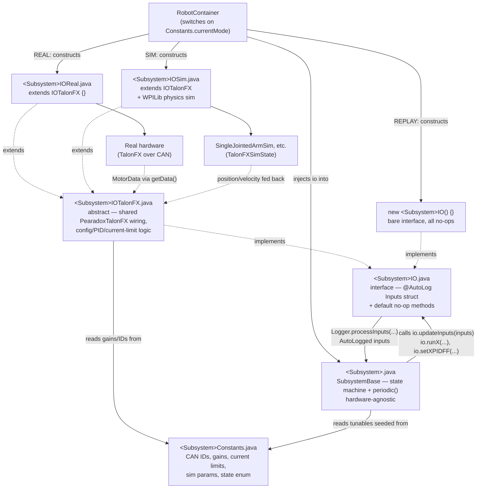

# Pearadox GammaBot — Robot Code Design Guidelines

These standards are extracted from the current codebase (AdvantageKit-based, WPILib Java, CTRE Phoenix 6 drivetrain/mechanisms). They describe the conventions already in consistent use across `drive`, `launcher`, `intake`, `feeder`, `spindexer`, `turret`, and `vision` so new subsystems and features stay consistent with the rest of the robot.

## 1. Subsystem architecture: IO abstraction

Every subsystem follows the same layered structure so logic can run identically on real hardware, in simulation, and in log replay:

```
<Subsystem>.java              // SubsystemBase: state machine + periodic logic, hardware-agnostic
<Subsystem>IO.java             // interface: @AutoLog inputs struct + default no-op hardware methods
<Subsystem>IOTalonFX.java      // abstract base class: shared TalonFX wiring (real motor I/O)
<Subsystem>IOReal.java         // `extends <Subsystem>IOTalonFX {}` — real robot, no overrides needed
<Subsystem>IOSim.java          // `extends <Subsystem>IOTalonFX` — adds a physics sim (SingleJointedArmSim, etc.)
<Subsystem>Constants.java      // CAN IDs, gains, current limits, sim parameters, state enum
```



*Solid arrows are runtime data/call flow; dotted arrows are static extends/implements relationships. `Sub` only ever talks to the `IOIface` boundary — it has no compile-time knowledge of `IOTalonFX`, `IOReal`, `IOSim`, or the hardware/physics behind them.*

Rules:
- The subsystem class (`Launcher`, `Intake`, etc.) never imports CTRE/hardware classes directly — it only calls methods on its `IO` interface. This is what makes REAL/SIM/REPLAY swappable in `RobotContainer`.
- `IO` interfaces declare `default void method() {}` no-ops rather than abstract methods, so REPLAY mode can instantiate the bare interface (`new LauncherIO() {}`) without implementing anything.
- The `@AutoLog` inputs struct is a plain field-holding static class nested in the `IO` interface (e.g. `LauncherIOInputs`), never a record — AdvantageKit's annotation processor generates the `*AutoLogged` companion class from it.
- Motor telemetry is grouped into a single value type per motor (`PearadoxTalonFX.MotorData`, a record) rather than separate loose fields for position/velocity/voltage/current/temperature/connected.
- Put shared behavior (config-apply retries, current-limit setters, PID setters) in the abstract `IOTalonFX` base class, not duplicated in `IOReal`/`IOSim`. `IOSim` should override only `updateInputs` to layer a physics sim on top of the TalonFX sim state.
- Simple subsystems (LEDs, single-purpose helpers) may skip the IO split if they have no hardware to swap — see `LEDStrip`. Reserve the full IO pattern for anything with real motors/sensors.

## 2. Motor construction: `PearadoxTalonFX`

Never instantiate `TalonFX` directly in an IO implementation — use `frc.lib.drivers.PearadoxTalonFX`, which:
- applies the `TalonFXConfiguration` with retry-until-ok semantics,
- registers a fixed set of telemetry signals at `Constants.LOOP_FREQUENCY` and calls `optimizeBusUtilization()`,
- registers those signals with `PhoenixUtil` for synchronized `refreshAll()` in `Robot.robotPeriodic()`,
- tracks per-mechanism current draw via `EnergyTracker.Compeartment` for battery/brownout accounting,
- exposes telemetry as a single `getData()` → `MotorData` call.

Any new motor-driven mechanism should be built on `PearadoxTalonFX`, not raw CTRE APIs, so it participates in bus optimization and energy tracking automatically.

## 3. Constants conventions

- One `<Subsystem>Constants` class per subsystem, holding: CAN IDs, current limits, gearing, sim physics parameters (DCMotor, mass, length/radius), and a `<Subsystem>_MOTOR_CONFIG()` factory method that builds and returns the `TalonFXConfiguration`.
- Keep the constructed `TalonFXConfiguration` and its `Slot0Configs` as `public static final` fields (`LAUNCHER_CONFIG`, `LAUNCHER_CONFIG_SLOT0`) so `LoggedTunableNumber` defaults can read the as-shipped gains, and so runtime PID updates (`setLauncherPIDFF`) mutate the same config object that gets re-applied to the motor.
- State enums (`LauncherState`, `IntakeState`) live in `<Subsystem>Constants`, not in the subsystem class itself.
- When a state maps to fixed setpoints (angle, voltage, gain slot), express it as a `record` + `Map.of(...)` (see `IntakeConstants.StateConfig`/`INTAKE_STATE_MAP`) rather than a chain of `if/else` on the enum inside the subsystem.
- Comment *why*, not *what*, next to a constant when the value encodes a tuning decision or an issue reference (e.g. `// changed 3/17/26 for #119`). Bare magic numbers should carry a units comment (`// in rps`, `// V`).
- Field geometry constants (`Constants.FieldConstants`) are derived from `AprilTagFieldLayout` tag poses plus `Units.inchesToMeters(...)` offsets — never hardcode field coordinates that can instead be derived from a tag pose.

## 4. Units

- Store and pass angles in **radians** and rotational velocities in **rotations per second (rps)** internally; convert only at the IO boundary or when interfacing with a CAD/CAN-native unit (motor rotor rotations).
- Use `edu.wpi.first.math.util.Units` for all conversions (`Units.degreesToRadians`, `Units.rotationsToDegrees`, `Units.inchesToMeters`, ...) — never hand-roll a `* Math.PI / 180` conversion.
- Every raw numeric constant that isn't dimensionless should carry a trailing unit comment (`// rps`, `// m`, `// deg`).
- Gearing is applied as a multiply/divide by a named `GEARING` constant at the point of unit conversion, not baked into arbitrary magic numbers.

## 5. Tunable values: `LoggedTunableNumber`

- Any PID gain, feedforward term, current limit, or setpoint you expect to iterate on at competition should be a `LoggedTunableNumber`, not a bare constant — this exposes it live on NetworkTables/AdvantageScope while defaulting to the constant value when not in tuning mode.
- Construct with a descriptive dashboard key namespaced by subsystem (`"Launcher/kP"`, `"Hood/kG-AngleOffset-Deg"`).
- In `periodic()`, check `tunable.hasChanged(hashCode())` (OR'd across the related group of gains) before re-applying to hardware — don't call `io.setXPIDFF(...)` unconditionally every loop.
- Prefer `LoggedTunableNumber.ifChanged(hashCode(), () -> io.setX(...), gain1, gain2, ...)` for groups of related gains when it keeps the check/apply pairing clearer than a long `||` chain.

## 6. Logging (AdvantageKit)

- Every subsystem's `periodic()` starts with `io.updateInputs(inputs); Logger.processInputs("<Subsystem>", inputs);` before any control logic runs.
- Use `@AutoLogOutput` on getters/fields you want auto-published, and `Logger.recordOutput("<Subsystem>/<Signal>", value)` for computed/derived values inside `periodic()` or IO methods (e.g. setpoints, error, in-range flags).
- Log setpoints from the IO layer at the moment they're commanded (`Logger.recordOutput("Launcher/VelocitySetpointRPS", velocityRPS)` inside `runLauncherVelocity`), not just from the subsystem layer, so replay/tuning can see exactly what was sent to hardware.
- Use `LoggedTracer.reset()` / `LoggedTracer.record("<Label>")` to bracket and log the wall-clock cost of expensive periodic work (vision solve, Phoenix refresh, energy tracking) — see `Robot.robotPeriodic()` and the `MovingShotSolver` default command.
- Never gate core control logic on whether logging succeeds; logging is observational and must not affect behavior.

## 7. Simulation

- `IOSim` extends the same `IOTalonFX` base as `IOReal` and drives the real `TalonFXSimState` from a WPILib physics sim (`SingleJointedArmSim`, etc.), rather than reimplementing control logic — this way the same PID/motion-magic code path runs in both REAL and SIM.
- Sim physics constants (`DCMotor`, mass, radius/length, MOI) live in `<Subsystem>Constants` alongside the real hardware constants, clearly grouped under a `// SIM` comment.
- Feed `TalonFXSimState.setSupplyVoltage(12)` before pulling `getMotorVoltage()`, then push the physics result back with `setRawRotorPosition`/`setRotorVelocity` (converting through gearing/units) each `updateInputs` call.
- Gate any sim-only visual/debug update (e.g. `LauncherVisualizer`) behind `Constants.currentMode == Mode.SIM` inside the subsystem's `periodic()`, not inside the IO layer.

## 8. RobotContainer / mode wiring

- `RobotContainer`'s constructor is the single place that switches on `Constants.currentMode` (`REAL` / `SIM` / default→`REPLAY`) to choose which `IO` implementation each subsystem gets. Subsystems and commands never check the mode themselves.
- REPLAY branch always uses the bare anonymous IO interface (`new LauncherIO() {}`) for every subsystem — this is what makes replay a true no-hardware no-op.
- Cross-subsystem dependencies are wired as method references passed into constructors (`drive::getChassisSpeeds`, `drive::getRotation`, `intake::turretHasClearance`) rather than subsystems reaching into each other via statics or singletons. Exceptions (`LEDStrip.getInstance()`, `MovingShotSolver.getInstance()`) are deliberate singletons for cross-cutting concerns, not the default pattern.
- Button bindings go in `configureButtonBindings()`, autonomous named commands in `registerNamedCommands()`, and auto chooser options in `setUpAutonomousCommand()` — keep these three concerns in their own methods rather than interleaving them.

## 9. Commands and state machines

- Subsystems expose intent-revealing setter methods (`setIdle()`, `setScoring()`, `setManual()`, `setIntaking()`) that just assign the state enum; the actual hardware behavior for each state is computed once in `periodic()` off of the current state. Don't push per-call hardware writes into the setters themselves.
- Prefer composed WPILib command factories (`Commands.startEnd`, `Commands.either`, `RunCommand`, `InstantCommand`, `SequentialCommandGroup(...).repeatedly()`, `.finallyDo(...)`, `.withTimeout(...)`) over hand-written `Command` subclasses. Reserve a full `Command` subclass (see `ShootOnTheMove`) for genuinely stateful multi-subsystem behavior that doesn't compose cleanly.
- Always pair a start action with cleanup on interruption/end (`.finallyDo(...)`, `.onFalse(...)`) so a cancelled command leaves the subsystem in a safe state (stopped feeder/spindexer, idle launcher) — don't rely on the next command to clean up.
- Use `Commands.either(...)` keyed off subsystem state (e.g. `launcher.getLauncherState() == LauncherState.MANUAL`) to branch button behavior, rather than duplicating trigger bindings per mode.

## 10. Naming

- Package-per-subsystem under `frc.robot.subsystems.<name>`, lowercase, matching the mechanism name.
- Class names: `<Subsystem>`, `<Subsystem>IO`, `<Subsystem>IOTalonFX`, `<Subsystem>IOReal`, `<Subsystem>IOSim`, `<Subsystem>Constants`, `<Subsystem>Visualizer` — don't deviate from this suffix scheme for new mechanisms.
- Getter/setter pairs favor explicit verbs matching intent (`setIntaking`, `setDeployed`, `zeroHood`, `requestZero`/`undoZero`) over generic `setState(x)` calls at the call site.
- CAN IDs are named `<MECHANISM>_<ROLE>_ID` (e.g. `LAUNCHER_1_CAN_ID`, `HOOD_ID`, `PIVOT_1_LEADER_ID`) and centralized in the subsystem's `Constants` class — never inlined at the construction site.

## 11. Formatting and tooling

- Code is auto-formatted with **Spotless + google-java-format**, wired to run before every compile (`compileJava.dependsOn(spotlessApply)`). Don't hand-format against this — let Spotless own it, and run `./gradlew spotlessApply` if unsure.
- Unused imports are removed automatically (`removeUnusedImports()`); don't leave dead imports expecting a linter to catch them later — Spotless already strips them on build.
- `.gradle` build files are formatted with `greclipse()` at 4-space indent.
- Keep `// TODO:` comments for genuinely open tuning/design questions (e.g. `// TODO: TUNE THIS.`) — the codebase uses them actively as a punch list, so leave them discoverable rather than silently deferring in your head.

## 12. Safety / robot-level concerns

- Brownout voltage is explicitly configured (`RobotController.setBrownoutVoltage(Constants.BROWNOUT_VOLTAGE)`) and per-mechanism current draw is tracked continuously via `EnergyTracker` — any new high-current mechanism should register a `Compeartment` so it's accounted for in brownout/energy budgeting.
- Peak forward/reverse voltage limits are set explicitly per mechanism in its `TalonFXConfiguration` (e.g. hood ±4V) to protect fragile mechanisms even when a bug commands a large setpoint error — set these deliberately for any new position-controlled mechanism, don't leave them at the ±12V default.
- Motion affecting driver safety (turret zeroing, hood zeroing) uses `.ignoringDisable(true)` explicitly and deliberately, with a comment explaining why it's safe to run disabled — don't add `ignoringDisable` without that justification.
